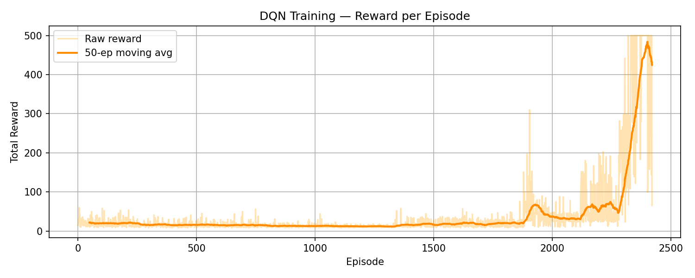
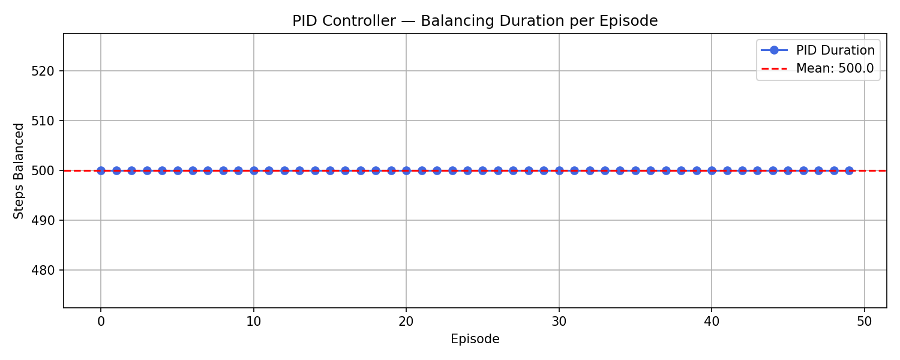
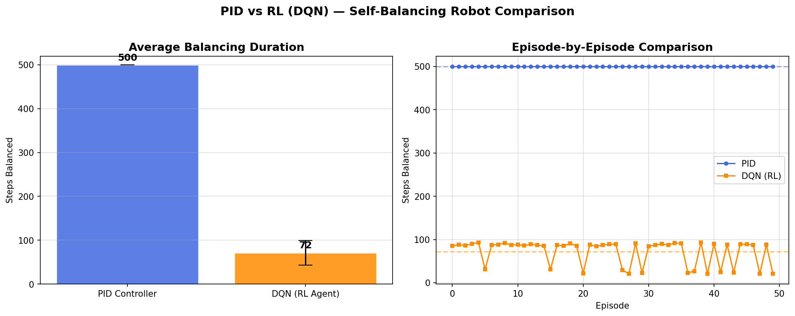

# 🤖 Self Balancing Robot - Reinforcement Learning (DQN)

## 📌 Overview
This project applies **Deep Q-Network (DQN)** Reinforcement Learning to solve the **CartPole-v1** balancing problem — simulating the control logic of a self-balancing robot. The trained DQN agent is then compared against a classical **PID Controller** to evaluate both approaches.

---

## 🎥 Demo


---

## 📊 Results

### DQN Training — Reward per Episode

> The agent starts with low rewards (~20) and gradually learns to balance, reaching a peak reward of **500** after ~2400 episodes.

### PID Controller Performance

> The PID Controller consistently achieves a perfect score of **500 steps** across all 50 episodes.

### PID vs DQN Comparison


---

## 📈 Performance Summary

| Controller | Avg Balancing Steps | Consistency |
|---|---|---|
| PID Controller | **500** | ✅ Perfect |
| DQN (RL Agent) | **72** | ⚠️ Still Learning |

### 🔍 Key Observations
- **PID** achieves perfect balance immediately — no training needed
- **DQN** requires ~2400 episodes to learn but improves continuously
- PID wins on **consistency**, DQN wins on **adaptability potential**

---

## 🧠 Algorithm — Deep Q-Network (DQN)

| Feature | Detail |
|---|---|
| Environment | CartPole-v1 (Gymnasium) |
| Algorithm | DQN (Deep Q-Network) |
| Framework | Stable Baselines3 + PyTorch |
| Training Episodes | ~2400+ |
| Peak Reward | 500 |
| Exploration Strategy | Epsilon-Greedy |
| Learning | Replay Buffer |

---

## 📁 Project Files

| File | Description |
|---|---|
| `self_balancing_robot_RL.ipynb` | Main Jupyter Notebook |
| `dqn_training.png` | DQN reward per episode graph |
| `pid_performance.png` | PID balancing performance graph |
| `pid_vs_rl_comparison.png` | PID vs DQN comparison chart |
| `cartpole_comparison__1_.mp4` | Side-by-side video comparison |

---

## 🛠️ Technologies Used
- **Python 3**
- **Gymnasium** – CartPole-v1 simulation environment
- **Stable Baselines3** – DQN algorithm implementation
- **PyTorch** – Neural network backend
- **NumPy** – Numerical computations
- **Matplotlib** – Plotting training graphs

---

## 📦 Requirements

```bash
pip install -r requirements.txt
```

---

## ▶️ How to Run
1. Clone this repository:
```bash
   git clone https://github.com/yourusername/Self-Balancing-Robot-RL.git
```
2. Install dependencies:
```bash
   pip install -r requirements.txt
```
3. Open the notebook:
```bash
   jupyter notebook self_balancing_robot_RL.ipynb
```
4. Run all cells to train the DQN agent and see results!

---

## 🔗 Related Project
Check out the [Arduino Hardware Implementation](https://github.com/Madii-hoc/Self-Balancing-Robot-Arduino)
where this same robot is built with real hardware using PID control!

---

## 👤 Author
**Your Name**
- GitHub: [@Madii-hoc](https://github.com/Madii-hoc)
